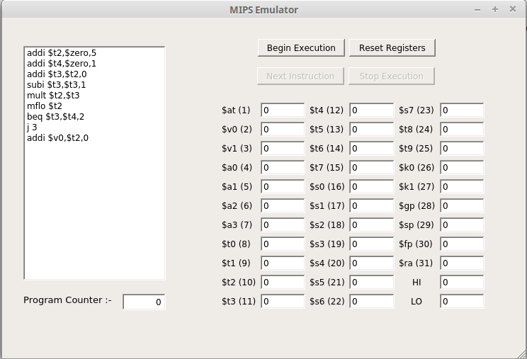
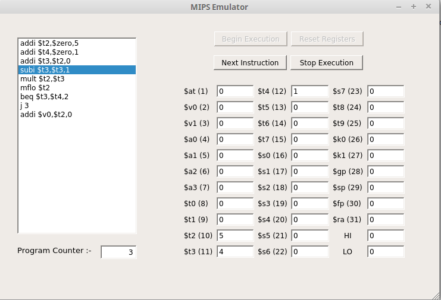
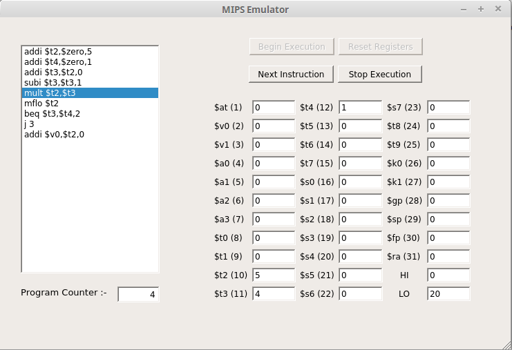
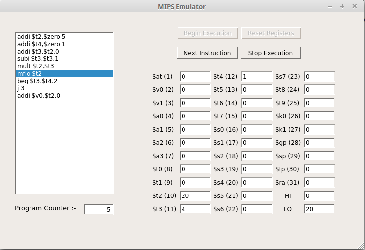
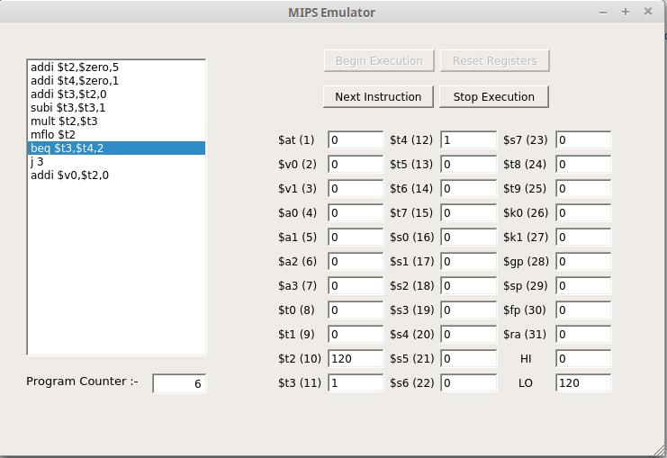
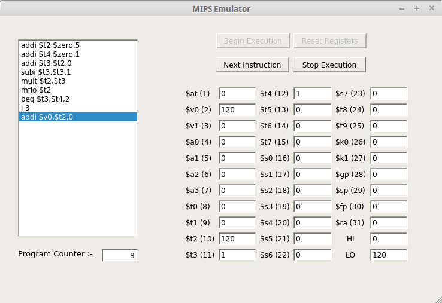

# MIPS Emulator

#### Contributions 

#### Open-Source       

A simple and basic MIPS emulator in C++, with UI in Qt.

The following MIPS code is a simple implementation of finding the **Factorial** of the number placed in register *$t2*. 

The final computed value is placed again in the *$t2* register.

(*Sorry for the screenshots display :P , a gif of the same will be replacing the screenshots soon*)

#### Screenshot 1
   

#### Screenshot 2
   

#### Screenshot 3
  

#### Screenshot 4
   
 
####  Screenshot 5
   

#### Screenshot 6
   

#### Screenshot 7
 

TODO :-
- [ ] Add gif instead of screenshots
- [ ] Add documentation for all the instruction supported in the emulator
- [ ] Improve UI
